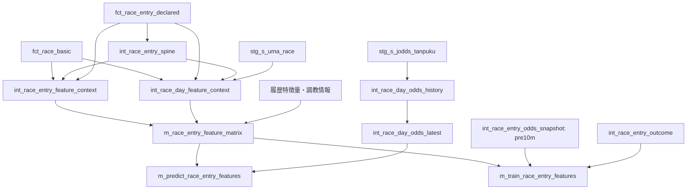

# dbtの学習・当日推論ルート

## 現行の責務分離

特徴量計算は `m_race_entry_feature_matrix` と上流の `features/*` に集約する。
共通matrixの粒度は `race_id, kettonum` で、現レースの結果・オッズは含めない。
Pythonの学習／推論は `m_training_inputs_v1` / `m_race_inputs_v1` を出走馬の母集団とし、別のquote relationと同一SQLで読み取る。オッズ・人気の特徴量化はCoreの `assemble_odds_features` に集約する。詳細は [odds_input_contract.md](odds_input_contract.md)。以下の旧mart出口は互換モデルとして残る。



詳細な入力・粒度は [dbt_race_day_inference_table_design.md](dbt_race_day_inference_table_design.md) を参照する。

## 学習と推論の境界

- 学習contextは蓄積系の出馬・レース情報から作り、速報出馬情報やオッズを読まない。
- 当日contextは速報出馬情報で馬体重・馬体重増減・取消状態を解決する。
- 現行の天候・馬場・頭数は `fct_race_basic` 側の値を使う。
- 履歴特徴量は事前作成済みのlookupを使い、当日ルートで履歴集計全体を再構築しない。
- 学習出口は `pre10m` オッズと結果を内部結合する。最終オッズ `final` は学習入力にしない。
- 推論出口は対象日の取消馬を除外し、最新オッズを左結合する。オッズ欠損の馬も残し、`odds_source = missing_live_odds` とする。

## 実行単位

実値は Git 管理外の `.env` に置き、`scripts/dbt` から自動で読む。
各selectorは更新対象を選ぶだけで、rawの取り込みやPython推論は実行しない。

| selector | 更新対象・前提 |
|---|---|
| `training_default` | `m_training_inputs_v1` と `int_odds_pre10m_v1` の上流。手動の旧snapshotは更新しない。期間指定なしのオッズ更新は直近7日 |
| `odds_contract_v1` | 新しい入力view・オッズ正規化view・10分前snapshotとその契約テスト。履歴特徴量は作成済みであること |
| `race_week_prepare` | `race_week_static` / `feature_matrix` タグのモデル。履歴lookup・結果テーブル・stagingは事前に利用可能であること |
| `race_day_update` | 当日オッズ履歴・最新値、当日context、共通matrix、推論出口と、それに依存する `m_training_inputs_v1` view。`feature_input_mode: latest` が必要 |
| `race_day_odds_update` | 当日オッズ履歴と最新値のみ。推論出口は別途更新する |
| `post_race_finalize` | `post_race` / `training` タグの結果・context・matrix・学習出口 |

`training_default` 以外の上記selectorはタグ・明示モデルの選択であり、親モデルを自動で全件追加しない。
`race_day_update` は `m_race_inputs_v1` の置換時に削除される依存view `m_training_inputs_v1` も、依存順に再作成する。学習結果などの別の親モデルは更新対象に追加しない。
当日までに対象日の `n_race` / `n_uma_race` とspineを用意しておく。

### 当日の一括更新

```bash
scripts/dbt build --project-dir dbt/harp --profiles-dir dbt/harp --no-version-check \
  --selector race_day_update --vars '{feature_input_mode: latest}'
```

`target_held_date` を省略した場合はDBの `current_date` を使う。
日付を固定する場合は同じvarsに `target_held_date: "YYYY-MM-DD"` を追加する。

### オッズだけ更新して推論入力へ反映

馬体重・取消・履歴特徴量を含むmatrixが対象日について作成済みの場合に使う。

```bash
scripts/dbt build --project-dir dbt/harp --profiles-dir dbt/harp --no-version-check \
  --selector race_day_odds_update
scripts/dbt build --project-dir dbt/harp --profiles-dir dbt/harp --no-version-check \
  --select m_predict_race_entry_features
```

対象日を固定するときは両方のコマンドに同じ `target_held_date` を渡す。
速報出馬情報が変わった場合は当日の一括更新を使う。

### レース後

```bash
scripts/dbt build --project-dir dbt/harp --profiles-dir dbt/harp --no-version-check \
  --selector post_race_finalize
```

`feature_input_mode` の既定値は `training`。
旧変数名 `feature_snapshot_mode` は互換入力として残っているが、新しい指定では `feature_input_mode` を使う。
`all` は対象日の当日contextと、それ以外の学習contextを合わせる検証用モード。

## 保持している互換経路

`m_train_race_horse_past5`、`race_info_wide`、`fct_race_odds_result` は通常の学習・推論Portから参照しない。旧分析キャッシュ・探索用パッケージには参照が残るため、物理リレーションは削除していない。`training_default` も新Portの参照先を更新する。

新matrixも調教・DM情報を `int_race_entry_enriched` から取得しており、履歴特徴量も
`fct_race` / `fct_race_entry` を使っている。これらは現行DAGの一部である。
通常の学習・推論・artifact説明のPortは移行済み。旧基礎モデルの責務分割と探索用ヘルパーの整理は別の範囲となる。

旧overlay、未使用の派生mart、lab・sokuhoモデルは現行DAGから除外済み。
SQL/YAMLの削除は既存DBリレーションの削除を伴わない。
