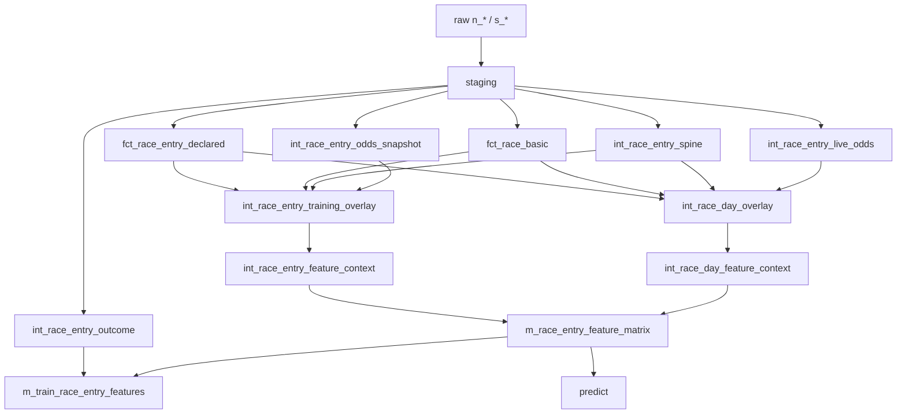

# dbt レース当日推論モデル設計

## 目的

- レース情報は対象週だけを増分更新する。
- レース当日の dbt 実行を軽くする。
- 学習用と推論用で特徴量ロジックを二重管理しない。
- レース前に使えない結果情報の混入を防ぐ。

詳細なテーブル設計は `docs/design/dbt_race_day_inference_table_design.md` を参照する。

## 基本方針

特徴量生成ロジックは `m_race_entry_feature_matrix` に集約する。

学習用モデルと推論用モデルは、特徴量を再計算せず、共通の feature matrix に対する薄い出口モデルにする。

```text
共通特徴量ロジック
  m_race_entry_feature_matrix

出口
  m_train_race_entry_features         = feature_matrix(pre10m/final) + outcome
  m_predict_race_entry_features       = feature_matrix(latest)
```

## 全体DAG



## モデル責務

| モデル | 粒度 | 役割 | 更新タイミング |
|---|---:|---|---|
| `int_race_entry_spine` | `race_id, kettonum` | 学習/推論共通の出走馬spine | 週次/前日 |
| `fct_race_basic` | `race_id` | レース前に分かる基本情報 | 週次/前日 |
| `fct_race_entry_declared` | `race_id, kettonum` | レース前に分かる出走馬情報 | 週次/前日 |
| `int_race_entry_odds_snapshot` | `race_id, horse_number, feature_snapshot_type` | 学習/検証用オッズ。`pre10m` / `final` のみ | レース後/定期 |
| `int_race_entry_live_odds` | `race_id, horse_number, feature_snapshot_type` | 当日 `s_jodds` 由来の最新オッズ。`latest` のみ | 当日 |
| `int_race_entry_training_overlay` | `race_id, kettonum, feature_snapshot_type` | 学習/検証用overlay。`pre10m` / `final` | レース後/定期 |
| `int_race_day_overlay` | `race_id, kettonum, feature_snapshot_type` | 当日更新情報。`latest` のみ | 当日 |
| `int_race_entry_feature_context` | `race_id, kettonum, feature_snapshot_type` | 学習/検証用 feature matrix 入力 | レース後/定期 |
| `int_race_day_feature_context` | `race_id, kettonum, feature_snapshot_type` | 当日推論用 feature matrix 入力 | 当日 |
| `int_race_entry_outcome` | `race_id, kettonum` | 着順・結果・教師ラベル | レース後 |
| `m_race_entry_feature_matrix` | `race_id, kettonum, feature_snapshot_type` | 共通特徴量行列 | 週次/前日/当日 |
| `m_predict_race_entry_features` | `race_id, kettonum` | 推論用出力 | 当日 |
| `m_train_race_entry_features` | `race_id, kettonum, feature_snapshot_type` | 学習用出力。`pre10m` / `final` | レース後/定期 |

## ロジック一元化ルール

1. 特徴量計算は `m_race_entry_feature_matrix` またはその上流の `features/*` に置く。
2. `m_train_*` と `m_predict_*` には特徴量計算を書かない。
3. `m_train_*` は `pre10m` / `final` の feature matrix に `outcome` を join して教師ラベルを付けるだけにする。
4. `m_predict_*` は `latest` の feature matrix を対象日に絞るだけにする。
5. レース後にしか分からない列は feature matrix に入れない。

## データ分離

### レース前に使える情報

- レース基本情報
- 出走馬
- 枠番・馬番
- 騎手・調教師
- 斤量
- コース属性
- 過去成績由来の履歴特徴量
- 調教情報

### 当日に更新される情報

- オッズ
- 人気
- 馬体重
- 馬体重増減
- 天候
- 馬場状態
- 取消/除外
- 発走時刻変更

### レース後にしか使わない情報

- 着順
- タイム
- 着差
- 通過順
- 上がり
- レースラップ
- 払戻
- `is_win`
- `is_place`

## タグ設計

| タグ | 対象 |
|---|---|
| `race_week_static` | 週次/前日に作る静的・準静的モデル |
| `race_day_live` | 当日に軽く更新するモデル |
| `post_race` | レース後に更新する結果モデル |
| `feature_matrix` | 学習/推論共通の特徴量行列 |
| `inference` | 推論用出口モデル |
| `training` | 学習用・学習入力モデル |
| `expensive` | 当日実行から除外したい重いモデル |

## 実行単位

### 週次/前日

対象週のレース・出走馬・履歴特徴量を作る。

```bash
dbt build --selector race_week_prepare \
  --vars '{race_from_date: "2026-05-25", race_to_date: "2026-05-31"}'
```

### レース当日

当日更新情報と推論用出口だけを更新する。

```bash
dbt build --selector race_day_update \
  --vars '{feature_snapshot_mode: "latest"}'
```

未指定時は `target_held_date = current_date` として実行する。
`feature_snapshot_mode = latest` は当日推論用の `latest` snapshot だけを feature matrix に反映する指定。
過去日や検証対象日を明示したい場合だけ `--vars` で上書きする。

### レース後

結果情報と学習用出口を更新する。

```bash
dbt build --selector post_race_finalize \
  --vars '{target_held_date: "2026-05-30"}'
```

`feature_snapshot_mode` は未指定のままにする。
未指定時は `training` mode になり、feature matrix は `pre10m` / `final` snapshot を作る。

## Materialization 方針

| 種別 | materialization | 理由 |
|---|---|---|
| staging | `view` | 1:1整形に限定 |
| race/entry basic | `incremental` | 対象週だけ更新 |
| live overlay | `incremental` | 当日だけ頻繁に更新 |
| live odds | `incremental` | `s_jodds` latest だけを対象日で更新 |
| training odds snapshot | `incremental` | `pre10m` / `final` だけを履歴保持 |
| history features | `incremental` | 重いので再計算範囲を限定 |
| feature matrix | `incremental` | 学習/推論共通の中核 |
| training output | `incremental` or `table` | 用途に応じて選択 |
| inference output | `table` or `view` | 当日対象だけなら軽量 |

## セレクタ案

```yaml
selectors:
  - name: race_week_prepare
    description: Build static weekly race inputs and common feature matrix.
    definition:
      union:
        - method: tag
          value: race_week_static
        - method: tag
          value: feature_matrix

  - name: race_day_update
    description: Refresh race-day live overlay, feature context/matrix, and inference output.
    definition:
      union:
        - method: tag
          value: race_day_live
        - method: tag
          value: inference

  - name: post_race_finalize
    description: Refresh post-race outcomes and training output.
    definition:
      union:
        - method: tag
          value: post_race
        - method: tag
          value: training
```

## 移行ステップ

1. `fct_race_entry` を「レース前情報」と「結果情報」に分ける。
2. `fct_race` を「レース基本情報」と「レース後情報」に分ける。
3. `m_race_entry_feature_matrix` を共通特徴量の正本にする。
4. 当日 `latest` は `s_jodds` から `int_race_entry_live_odds` へ分離する。
5. 学習/検証は `int_race_entry_odds_snapshot` を `pre10m` / `final` のみにする。
6. `m_train_race_entry_features` を feature matrix + outcome の薄い wrapper として追加し、既存の学習mart利用側を段階移行する。
7. 推論martを latest feature matrix の薄い wrapper として追加する。
8. 当日実行 selector から重い履歴特徴量と `expensive` モデルを除外する。

## 注意点

- 実行時に対象日や期間が分かっている場合は、incremental の直近日付 fallback より `race_from_date` / `race_to_date` / `target_held_date` を優先する。
- 学習用オッズは `pre10m` / `final` に限定し、当日推論の `latest` とはテーブル境界で分ける。
- feature matrix に教師ラベルや結果由来特徴量を入れない。
- 推論martの追加は新しい特徴量ロジック追加ではなく、出口追加として扱う。
