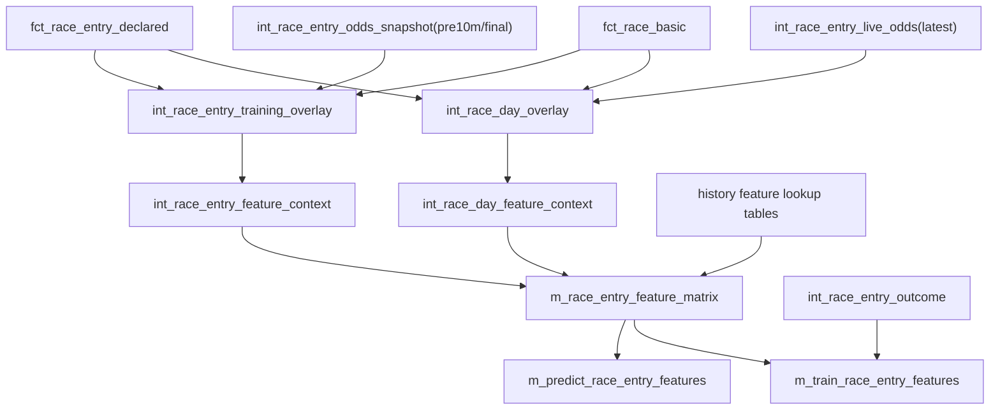

# dbt レース当日推論 テーブル設計詳細

## 位置づけ

本書は `docs/design/dbt_race_day_inference_strategy.md` の具体設計。

目的は以下。

- 学習用と推論用で特徴量ロジックを二重管理しない。
- レース当日はオッズ・馬体重・馬場状態などの軽い差し替えだけにする。
- レース後情報が推論特徴量へ混入しないように、テーブル境界で分離する。

## 設計の核

特徴量計算は次の2段に分ける。

```text
1. feature_context
   レース前/当日入力を解決する層。
   オッズ、馬体重、馬場状態などの当日値もここで反映する。

2. feature_matrix
   feature_context を入力に、学習/推論で共通の特徴量を作る層。
   学習用/推論用martはここから薄く分岐する。
```



## 新規/改修モデル一覧

| モデル | schema | materialized | unique key | 主なタグ |
|---|---|---|---|---|
| `fct_race_basic` | `core` | `incremental` | `race_id` | `race_week_static` |
| `fct_race_result` | `core` | `table` | `race_id` | `post_race` |
| `fct_race_entry_declared` | `core` | `incremental` | `race_id, kettonum` | `race_week_static` |
| `fct_race_entry_result` | `core` | `incremental` | `race_id, kettonum` | `post_race` |
| `int_race_entry_spine` | `intermediate` | `incremental` | `race_id, kettonum` | `race_week_static` |
| `int_race_entry_live_odds` | `intermediate` | `incremental` | `race_id, horse_number, feature_snapshot_type` | `race_day_live` |
| `int_race_entry_odds_snapshot` | `intermediate` | `incremental` | `race_id, horse_number, feature_snapshot_type` | `training`, `odds_snapshot` |
| `int_race_day_overlay` | `intermediate` | `incremental` | `race_id, kettonum, feature_snapshot_type` | `race_day_live` |
| `int_race_entry_training_overlay` | `intermediate` | `incremental` | `race_id, kettonum, feature_snapshot_type` | `training` |
| `int_race_day_feature_context` | `intermediate` | `incremental` | `race_id, kettonum, feature_snapshot_type` | `race_day_live` |
| `int_race_entry_feature_context` | `intermediate` | `incremental` | `race_id, kettonum, feature_snapshot_type` | `feature_matrix`, `training` |
| `m_race_entry_feature_matrix` | `mart` | `incremental` | `race_id, kettonum, feature_snapshot_type` | `feature_matrix`, `race_day_live`, `training` |
| `m_predict_race_entry_features` | `mart` | `table` | `race_id, kettonum` | `inference`, `race_day_live` |
| `int_race_entry_outcome` | `intermediate` | `incremental` | `race_id, kettonum` | `post_race`, `training` |
| `m_train_race_entry_features` | `mart` | `incremental` | `race_id, kettonum, feature_snapshot_type` | `mart`, `training`, `training_features` |

## grain方針

基本粒度は `race_id, kettonum`。

ただし、当日値やオッズ取得タイミングに依存するモデルは `feature_snapshot_type` を追加する。

```text
race_id, kettonum, feature_snapshot_type
```

想定する `feature_snapshot_type`。

| 値 | 用途 |
|---|---|
| `latest` | 当日推論用の最新値 |
| `pre10m` | 発走10分前以前の最新値 |
| `final` | 確定値/履歴学習用 |

学習用martは `pre10m` と `final` のみを持つ。
`latest` は当日推論専用として別ルートで扱う。

## core層

### `fct_race_basic`

レース前に分かるレース基本情報。

現在の `fct_race` から、レース後にしか分からない列を除いたもの。

主な列。

| 列 | 内容 |
|---|---|
| `race_id` | レースID |
| `held_date` | 開催日 |
| `held_year` | 開催年 |
| `held_year_month` | 開催月 |
| `jyo_cd` | 競馬場 |
| `kaiji` | 開催回 |
| `nichiji` | 開催日次 |
| `race_num` | レース番号 |
| `race_name` | レース名 |
| `distance_m` | 距離 |
| `surface` | 芝/ダート |
| `track_cd` | トラックコード |
| `course_kubun_cd` | コース区分 |
| `old_cd` | 年齢条件 |
| `race_level` | レース格 |
| `grade_cd` | グレード |
| `hassotime` | 発走時刻 |
| `planned_num_starters` | 登録/予定頭数 |
| `course_cluster` | コースクラスタ |
| `turn_direction` | 右/左/直線 |
| `straight_distance_m` | 直線距離 |
| `has_homestretch_slope` | 直線坂フラグ |

入れない列。

- `ten3f`
- `ten4f`
- `agari3f_race`
- `agari4f_race`
- `race_time_sec`
- レース後確定のラップ系

ロジック。

```text
stg_n_race / stg_s_race
  -> race_id生成
  -> 開催日・コース・距離・発走時刻を正規化
  -> course_feature_map / course_cluster_map を付与
  -> レース前に分かる列だけ出力
```

### `fct_race_result`

レース後に確定するレース単位情報。

主な列。

| 列 | 内容 |
|---|---|
| `race_id` | レースID |
| `final_surface_condition_cd` | 確定馬場状態 |
| `final_weather_cd` | 確定天候 |
| `ten3f` | 前半3F |
| `ten4f` | 前半4F |
| `agari3f_race` | レース上がり3F |
| `agari4f_race` | レース上がり4F |
| `race_time_sec` | 勝ち時計 |
| `race_pace` | `ten3f - agari3f_race` |
| `ten3f_ntile` | 同条件内ペース分位 |

### `fct_race_entry_declared`

レース前に分かる出走馬情報。

現在の `fct_race_entry` から、結果列を除いたもの。

主な列。

| 列 | 内容 |
|---|---|
| `race_id` | レースID |
| `kettonum` | 馬ID |
| `horse_name` | 馬名 |
| `horse_number` | 馬番 |
| `gate_number` | 枠番 |
| `age` | 年齢 |
| `sex_cd` | 性別 |
| `kinryo` | 斤量 |
| `tozai_cd` | 東西 |
| `jockey_cd` | 騎手 |
| `jockey_cat` | 騎手カテゴリ |
| `trainer_cd` | 調教師 |
| `sire_id` | 父 |
| `dam_id` | 母 |
| `damsire_id` | 母父 |
| `breeder_cd` | 生産者 |
| `blinker_cd` | ブリンカー |
| `birth_date` | 生年月日 |

入れない列。

- `result_order`
- `rank_1c` から `rank_4c`
- `agari3f`
- `agari4f`
- `time_diff`
- `time_sec`
- `is_win`
- `is_place`

ロジック。

```text
stg_n_uma_race_all
  -> race_id生成
  -> 出走馬行を作成
  -> stg_n_uma から血統/生産者/誕生日を付与
  -> 結果が無くても行を残す
```

注意。

現行の `stg_n_uma_race` は `result_order_raw is not null` 前提のため、推論用spineには使いにくい。
短期的には `stg_n_uma_race_all` を追加し、長期的には staging を source 1:1 に寄せる。
当日速報の `stg_s_uma_race` は、spine生成ではなく `int_race_day_overlay` で馬体重・取消/除外などの当日値を上書きするために使う。
そのため `race_day_update` は、対象日の出走馬行が `n_uma_race` に投入済みであることを前提にする。

### `fct_race_entry_result`

レース後に確定する馬単位結果。

主な列。

| 列 | 内容 |
|---|---|
| `race_id` | レースID |
| `kettonum` | 馬ID |
| `result_order` | 確定着順 |
| `rank_1c` | 1角通過順 |
| `rank_2c` | 2角通過順 |
| `rank_3c` | 3角通過順 |
| `rank_4c` | 4角通過順 |
| `agari3f` | 馬の上がり3F |
| `agari4f` | 馬の上がり4F |
| `time_diff` | 着差 |
| `time_sec` | 走破時計 |
| `dm_rank` | DM順位 |
| `running_style_cd` | 実績脚質 |
| `is_win` | 1着フラグ |
| `is_place` | 複勝圏フラグ |

## intermediate層

### `int_race_entry_spine`

学習/推論共通の出走馬spine。

主な列。

| 列 | 内容 |
|---|---|
| `race_id` | レースID |
| `kettonum` | 馬ID |
| `held_date` | 開催日 |
| `horse_number` | 馬番 |
| `entry_status` | `declared` / `scratched` / `resulted` |
| `is_prediction_target` | 推論対象フラグ |

ロジック。

```text
fct_race_entry_declared
  left join fct_race_entry_result
  -> 結果有無、取消/除外状態を付与
```

### `int_race_entry_live_odds`

当日 `s_jodds` の最新オッズだけを軽く正規化する。

grain。

```text
race_id, horse_number, feature_snapshot_type
```

主な列は `int_race_entry_odds_snapshot` と同じ。

ロジック。

```text
int_s_jodds_latest
  -> race_id, horse_number ごとの latest
  -> feature_snapshot_type = 'latest'
```

当日実行ではこのモデルだけを s_jodds ルートとして使い、重い履歴snapshotは読まない。

### `int_race_entry_odds_snapshot`

学習/検証用オッズを取得タイミング別に正規化する。

grain。

```text
race_id, horse_number, feature_snapshot_type
```

主な列。

| 列 | 内容 |
|---|---|
| `race_id` | レースID |
| `horse_number` | 馬番 |
| `feature_snapshot_type` | `pre10m` / `final` |
| `snapshot_at` | オッズ発表時刻 |
| `odds_tansho` | 単勝オッズ |
| `odds_fukusho_low` | 複勝下限 |
| `odds_fukusho_high` | 複勝上限 |
| `odds_fukusho_avg` | 複勝平均 |
| `odds_fukusho_weighted_avg` | 複勝加重平均 |
| `popularity` | 人気 |
| `odds_source` | `s_jodds` / `n_jodds` / `n_odds` |

ロジック。

```text
pre10m:
  published_manual.fct_jodds_snapshot

final:
  stg_n_odds_tanpuku の確定オッズ
```

優先順位。

```text
履歴再現: pre10m
結果分析: final
```

### `int_race_day_overlay`

当日に変わる値を、馬単位でまとめる。

grain。

```text
race_id, kettonum, feature_snapshot_type
```

主な列。

| 列 | 内容 |
|---|---|
| `race_id` | レースID |
| `kettonum` | 馬ID |
| `feature_snapshot_type` | オッズ/当日値の取得タイミング |
| `snapshot_at` | スナップショット時刻 |
| `horse_number` | 馬番 |
| `odds_tansho` | 単勝オッズ |
| `odds_fukusho_low` | 複勝下限 |
| `odds_fukusho_high` | 複勝上限 |
| `popularity` | 人気 |
| `h_weight` | 馬体重 |
| `weight_change` | 馬体重増減 |
| `weather_cd` | 天候 |
| `surface_condition_cd` | 馬場状態 |
| `live_num_starters` | 当日時点の頭数 |
| `is_scratched` | 取消/除外フラグ |
| `odds_source` | オッズ取得元。live odds 欠損時は `missing_live_odds` |
| `updated_at` | 更新時刻 |

ロジック。

```text
int_race_entry_spine
  left join int_race_entry_live_odds
    using race_id, horse_number
  -> live odds が無い馬も落とさず、feature_snapshot_type = latest / odds_source = missing_live_odds として残す
  left join s_uma_race / n_uma_race
    for h_weight, weight_change, scratch status
  left join fct_race_basic
    for weather, surface condition, planned starter count fallback
```

### `int_race_entry_training_overlay`

学習/検証用に、`pre10m` / `final` のオッズとレース前情報を馬単位にまとめる。

```text
int_race_entry_spine
  inner join int_race_entry_odds_snapshot
    using race_id, horse_number
  left join fct_race_entry_declared
  left join fct_race_basic
```

当日速報の `s_uma_race` は読まず、再現性のある学習入力だけを扱う。

### `int_race_day_feature_context`

当日推論用の feature matrix 直接入力。

```text
int_race_day_overlay
  -> latest のみ
  -> m_race_entry_feature_matrix
```

### `int_race_entry_feature_context`

学習/検証用の feature matrix 直接入力。

ここで「静的情報」と `pre10m` / `final` のsnapshot値を解決し、派生しやすい入力列を作る。

grain。

```text
race_id, kettonum, feature_snapshot_type
```

主な列。

| 列 | 内容 |
|---|---|
| `race_id` | レースID |
| `kettonum` | 馬ID |
| `feature_snapshot_type` | 特徴量取得タイミング |
| `held_date` | 開催日 |
| `held_year` | 開催年 |
| `held_year_month` | 開催月 |
| `horse_number` | 馬番 |
| `gate_number` | 枠番 |
| `horse_number_ratio` | 馬番/頭数 |
| `popularity` | 当日値優先の人気 |
| `popularity_ratio` | 人気/頭数 |
| `odds_tansho` | 当日値優先の単勝オッズ |
| `log_odds_tansho` | `ln(odds_tansho)` |
| `h_weight` | 当日値優先の馬体重 |
| `h_weight_bin` | 馬体重bin |
| `weight_change` | 当日値優先の馬体重増減 |
| `weather_cd` | 当日値優先の天候 |
| `surface_condition_cd` | 当日値優先の馬場状態 |
| `jyo_cd` | 競馬場 |
| `distance_m` | 距離 |
| `surface` | 芝/ダート |
| `track_cd` | トラックコード |
| `course_cluster` | コースクラスタ |
| `turn_direction` | 右/左/直線 |
| `straight_distance_bucket` | 直線距離bin |
| `age_month` | 年齢月 |
| `age_days` | 2歳/3歳戦向け日齢 |
| `kinryo_adj` | 性別補正済み斤量 |
| `ensei_type` | 遠征区分 |
| `is_prediction_target` | 推論対象 |

値解決ルール。

```text
odds/popularity:
  int_race_day_overlay を優先

h_weight/weight_change:
  int_race_day_overlay を優先
  無ければ fct_race_entry_declared 側の値

weather/surface_condition:
  int_race_day_overlay を優先
  無ければ fct_race_basic 側の事前値

num_starters:
  live_num_starters を優先
  無ければ planned_num_starters
```

## mart層

### `m_race_entry_feature_matrix`

学習/推論共通の正本。

grain。

```text
race_id, kettonum, feature_snapshot_type
```

入力。

```text
int_race_entry_feature_context      -- training mode: pre10m / final
int_race_day_feature_context        -- latest mode: latest
features/*
intermediate/entity/* cumulative lookup
intermediate/odds/* optional lookup
```

主な列グループ。

| グループ | 内容 |
|---|---|
| identity | `race_id`, `kettonum`, `feature_snapshot_type` |
| context | レース・馬・騎手・調教師・コースの入力 |
| odds | `odds_tansho`, `log_odds_tansho`, `popularity_ratio` |
| body_weight | `h_weight`, `h_weight_bin`, `weight_change` |
| course | `jyo_cd`, `distance_m`, `surface`, `track_cd`, `course_cluster` |
| horse_history | 馬の過去成績特徴量 |
| jockey_history | 騎手特徴量 |
| trainer_history | 調教師特徴量 |
| sire_history | 父/母/母父特徴量 |
| workout | 調教特徴量 |
| relative | レース内相対特徴量 |

入れない列。

- `result_order`
- `is_win`
- `is_place`
- `rank_1c` から `rank_4c`
- `agari3f`
- `time_diff`
- 現レース結果から逆算される列

ロジックの考え方。

```text
feature_snapshot_mode に応じた feature_context を起点にする。

training:
  int_race_entry_feature_context の pre10m / final を作る。
  post_race_finalize の通常モード。

latest:
  int_race_day_feature_context の latest を作る。
  race_day_update で明示指定する。

all:
  training と latest を同じ実行で作る検証用モード。

重い履歴特徴量は、事前に作ってある lookup table を join する。
当日変わる surface_condition_cd / h_weight_bin / popularity などは
feature_context 側で解決した値を使う。
```

当日変わる条件に依存する特徴量。

| 条件 | 対応 |
|---|---|
| `surface_condition_cd` | condition lookup を当日値で join |
| `h_weight_bin` | weight系 lookup を当日値で join |
| `popularity` | feature_context で比率・logを再計算 |
| `num_starters` | feature_context で当日頭数を優先 |

### `m_predict_race_entry_features`

推論用出口。

ロジック。

```text
m_race_entry_feature_matrix
  where held_date = target_held_date_expr()
    and feature_snapshot_type = var('feature_snapshot_type', 'latest')
    and not is_scratched
```

特徴量計算は書かない。

### `m_train_race_entry_features`

学習用出口。

ロジック。

```text
m_race_entry_feature_matrix
  where feature_snapshot_type in ('pre10m', 'final')
  join int_race_entry_outcome
    using race_id, kettonum
```

教師ラベル付与以外の特徴量計算は書かない。

## 既存モデルからの移行対応

| 現行 | 移行後 |
|---|---|
| `fct_race` | `fct_race_basic` + `fct_race_result` |
| `fct_race_entry` | `fct_race_entry_declared` + `fct_race_entry_result` |
| `int_race_entry_enriched` | `int_race_entry_feature_context` と一部 `m_race_entry_feature_matrix` へ分解 |
| `int_race_entry_odds` | `int_race_entry_odds_snapshot` へ拡張 |
| `m_train_race_horse_past5_features` | 段階的に `m_train_race_entry_features` へ移行 |
| 新規 | `m_train_race_entry_features` |
| 新規 | `m_predict_race_entry_features` |

## incremental条件

`race_id > max(race_id)` ではなく、開催日で更新範囲を切る。

```sql

where held_date between
  '{{ var("race_from_date", "1900-01-01") }}'::date
  and '{{ var("race_to_date", "2999-12-31") }}'::date

```

当日系は `target_held_date` で絞る。
未指定時は `current_date` を使う。

```sql
where held_date = {{ target_held_date_expr() }}
```

## index方針

Postgresでは以下を優先する。

| モデル | index |
|---|---|
| race系 | `race_id`, `held_date` |
| entry系 | `(race_id, kettonum)`, `(race_id, horse_number)`, `held_date` |
| odds snapshot / live odds | `(race_id, horse_number, feature_snapshot_type)` |
| overlay/context/feature_matrix | `(race_id, kettonum, feature_snapshot_type)`, `held_date` |
| 履歴lookup | lookup join key + period/date。特に当日matrixが参照する jockey/sire/dam/course 系 |

## 実行イメージ

### 週次/前日

```text
fct_race_basic
fct_race_entry_declared
int_race_entry_spine
history feature lookup tables
```

### 当日

```text
int_race_entry_live_odds
int_race_day_overlay
int_race_day_feature_context
m_race_entry_feature_matrix
m_predict_race_entry_features
```

当日の `m_race_entry_feature_matrix` は対象日の対象snapshotだけを更新する。
重い履歴特徴量そのものは更新しない。

### レース後

```text
fct_race_result
fct_race_entry_result
int_race_entry_odds_snapshot
int_race_entry_training_overlay
int_race_entry_feature_context
int_race_entry_outcome
m_train_race_entry_features
```

## 実装順

1. `stg_n_uma_race_all` を追加し、結果なし出走馬を扱えるようにする。
2. `fct_race_entry_declared` と `fct_race_entry_result` を追加する。
3. `fct_race_basic` と `fct_race_result` を追加する。
4. `int_race_entry_live_odds` を作り、当日 `latest` を s_jodds から軽く作る。
5. `int_race_entry_odds_snapshot` を作り、学習用 `pre10m` / `final` だけを持つ。
6. `int_race_day_overlay` と `int_race_entry_training_overlay` を作る。
7. `int_race_day_feature_context` と `int_race_entry_feature_context` を作る。
8. `m_race_entry_feature_matrix` を作る。
9. `m_train_race_entry_features` を wrapper として追加し、既存 `m_train_race_horse_past5_features` の利用側を段階移行する。
10. `m_predict_race_entry_features` を追加する。
11. selector とタグを追加する。

## 最小実装案

一気に全部分けず、最初は以下だけでもよい。

```text
1. fct_race_entry_declared
2. int_race_entry_live_odds
3. int_race_day_overlay
4. int_race_day_feature_context
5. m_predict_race_entry_features
```

この段階では既存の `int_race_entry_enriched` / `m_train_*` は壊さず、推論用の入口だけ整える。

その後、学習martを `m_race_entry_feature_matrix` に寄せて二重管理を解消する。
