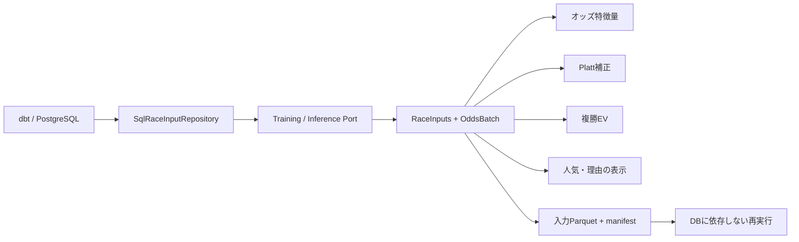

# オッズ入力契約とスキーマ変更への耐性

## 公開境界

HARPではHexagonal Architecture（Ports and Adapters）を使い、テーブル名・物理列名・SQL・DB接続をAdapterへ閉じ込める。UseCaseは論理的な要求と結果だけを扱う。



Portの公開APIは次の2つ。引数にテーブル名やSQLを渡さない。

- `TrainingRepositoryPort.load_training_input(RaceInputQuery) -> RaceInputs`
- `InferenceRepositoryPort.load_prediction_input(RaceInputQuery) -> RaceInputs`

Queryには開催日の範囲、論理特徴量名、カテゴリ特徴量名、学習目的変数、オッズ選択規則、最大レース数、論理条件を渡す。推論では結果ラベルを要求できない。上限は馬数ではなくレース数であり、同一レースを途中で切らない。

物理名の変更時には `RaceInputMapping` を更新する。オッズが別テーブルに分かれた場合も、この境界で結合する。別の複雑な構造ならAdapterのSQLまたはdbtの公開viewを変更する。構造の自動推測は行わない。

## 値と粒度

RaceInputsは特徴量・出走情報とOddsBatchを一体で返す。両者のキー集合は完全に一致する。取得は1つのSQL文で行い、途中の速報更新により特徴量用・Platt用・EV用オッズが別の値になることを防ぐ。

| フィールド | 契約 |
|---|---|
| race_id | 精度を失わない文字列ID。浮動小数のIDは拒否 |
| horse_number | 正の整数。通常の学習・推論は論理条件で馬番0を対象外にする |
| win_odds | 元金込みの単勝払戻倍率。利用可能なら有限で1以上 |
| place_low / place_high | 複勝払戻倍率の下限・上限。有限、1以上、下限≦上限 |
| win_popularity | 正の整数の人気順。不正・欠損なら人気特徴量を利用しない |
| published_at | タイムゾーン付きの発表日時 |
| available_at | 取得システムで利用可能になった日時。既存ソースでは不明なのでnull |
| cutoff_at | この行の選択締切。発走時刻不明のpre-start行ではnull |
| win_status / place_status | available / unavailable / stale / missing / invalid / unknown_cutoff |
| quote_id | キー・時刻・価格・人気から作る内容のハッシュ |
| captured_at | Adapterが入力を取得した時刻。発表・受信時刻の代用にはしない |

DB列の型差はAdapterで数値・日時に正規化する。タイムゾーンなしの列を読む場合は、Adapter設定で元のタイムゾーンを明示する。Coreは不明なタイムゾーンを補わない。RaceInputsとOddsBatchのDataFrame公開値は防御的コピーとなる。

馬番0の既存データは存在する。これはオッズ欠損と混同せず、通常処理の「馬番確定済み」という選択条件で除外する。負数・欠落キー・重複キーは契約違反である。

## 時点の規則

- 学習: `pre_start`。原則は予定発走日時の10分前以下で最新の発表。
- 当日推論: `latest_before`。`as_of` 以下で最新の発表。
- 締切と同時刻の発表を含む。鮮度の上限も境界を含む。標準の上限は300秒で、実行引数とartifactに保存する。
- `available_at` がある行は、それも締切以下であることを要求する。
- 最新行を選んでから券種ごとの値を検証する。最新行の単勝が欠けていても、古い有効値へ戻さない。
- 同一キー・発表・受信時刻の完全重複は同じ配信として扱う。価格が異なる競合重複は拒否する。
- 発走時刻不明なら `unknown_cutoff` / `unknown_start`。発走済みなら `race_closed`。締切が必要な計算や候補抽出を行わない。

既存rawの発表時刻はMMDDHHMMであり、時分だけへ切り詰めない。開催年を基準に12月/1月の隣接年を解決し、日本時間として正規化する。全ゼロ・空欄の発表時刻は中間オッズではないため引用候補に含めない。不正な日付・時刻は変換を失敗させる。

JRA-VANの定義では発表月日時分は中間オッズの項目で、データ作成年月日とは別項目である。作成日を受信時刻へ読み替えない。[JV-Data仕様書、オッズ1](https://jra-van.jp/dlb/sdv/sdk/JV-Data4901.pdf)

保存入力の再実行は再現できる。一方、受信日時のない過去rawから「当時このシステムが実際に知っていた情報」を完全には復元できない。`availability_basis=publication_time` と記録する。厳密な受信時点を要求するPolicyは、受信日時不明の入力を拒否する。

特徴量自体の過去時点再構築はこのオッズ契約では保証しない。現在のmatrixを過去のas_ofで読むことと、保存された入力を再実行することは区別する。

## 特徴量・Platt・EVの共通化

`assemble_odds_features` が、1つのOddsBatchから `odds_tansho`、`j_odds_tansho`、`log_odds_tansho`、`popularity`、`popularity_ratio` を作る。これらはモデルの論理特徴量名であり、物理列名ではない。

| 状態 | 処理 |
|---|---|
| モデルが必要とするオッズ特徴量がない | その馬のモデル推論を行わず理由を残す |
| 単勝がなくPlattが必要 | 未補正確率は残せるが、補正後確率と候補は出さない |
| 複勝だけがない | 算出可能な確率は残し、EV・候補を出さない |
| オッズを使わない学習 | オッズ欠損だけを理由に学習行を落とさない |
| レース内補正の全頭分がそろわない | そのレースの補正値を出さずincomplete_raceとする |

Plattへは選択済みの単勝を明示的に渡す。学習・推論ともバッチ内中央値によるオッズ補完は行わない。人気のみを要求するモデルでは、単勝とは独立して人気値の有効性を検証する。

複勝EVにはlow/high/midpoint/weightedを指定する。weightedは従来と同じ0.7×下限+0.3×上限。倍率と確率からEVを計算し、原則として最終オッズや払戻結果への代替取得は行わない。出力にはquote_id、時刻、計算状態、除外理由が残る。

## モデルと保存入力の互換性

新規学習artifactとmanifestに次を保存する。

- オッズ契約・オッズ特徴量のバージョン
- 論理特徴量名、学習の時点・鮮度規則、選択条件
- 許可する推論Policy
- availability_basisとsource_revision（物理bindingの識別用ハッシュ）
- 年・理由別の学習候補／除外件数

推論では契約の欠落、バージョン不一致、特徴量不一致、未許可Policy、学習契約より緩い鮮度を拒否する。旧artifactへメタデータだけを後付けしない。10分前からlatestへ変える場合は、比較評価を行った上で許可Policyを明示して再学習する。

推論入力は `HARP_PREDICTION_SNAPSHOTS_PATH/<snapshot_id>/` に保存する。

- `entries.parquet`: 実際に使用した特徴量・出走情報
- `odds.parquet`: 実際に選択したオッズと状態
- `manifest.json`: ファイルハッシュ、モデルハッシュ、時点・EV・資金設定、取得時刻

一時ディレクトリへ書いた後にrenameで公開する。保存失敗時には成功Resultを返さない。読み込みではmanifestとファイルのハッシュを検証する。モデルや判断パラメータが変わった再実行は拒否する。再実行はDBを読まない。

## dbtと運用

| 目的 | 現在の公開関係 |
|---|---|
| 共通の出走馬・特徴量 | mart.m_race_inputs_v1 |
| 学習母集団と目的変数 | mart.m_training_inputs_v1 |
| 学習用の10分前オッズ | intermediate.int_odds_pre10m_v1 |
| 当日オッズ履歴 | staging.stg_s_odds_quotes_v1 |
| 履歴オッズの日時正規化 | staging.stg_n_odds_quotes_v1 |

10分前snapshotは、値の有無にかかわらず対象馬を保持する。再実行で新たに欠損になった行は、過去に保存した価格を上書きして無効化する。予定時刻不明の行も保持する。別のpre-start分数を要求すると、10分前へ集約済みのAdapterは拒否する。

`.env` の接続値を読み、既存の特徴量を使って新経路だけを構築・検証する例:

```bash
scripts/dbt build --project-dir dbt/harp --profiles-dir dbt/harp \
  --selector odds_contract_v1 --vars '{"target_held_date":"2026-06-13"}'
```

学習期間の履歴を追加・再計算する例:

```bash
scripts/dbt build --project-dir dbt/harp --profiles-dir dbt/harp \
  --select int_odds_pre10m_v1 \
  --vars '{"race_from_date":"2013-01-01","race_to_date":"2026-12-31"}'
```

期間無指定のsnapshot更新は直近7日。指定範囲の行を増分更新する。`--full-refresh` は過去の保存範囲を置換するため、必要な全期間を指定する。親viewの再作成時は下流viewも同じ実行で構築する。

通常の学習は新しいentry/quote bindingを利用する。`--allow-prediction-policy latest_before` は、latest入力を許可することをartifactへ明記する引数であり、精度評価の代わりにはならない。

```bash
uv run python -m pipeline.jobs.run_predict \
  --artifact pipeline/artifacts/models/is_place_platt_v1.pkl \
  --from-date 2026-06-13 --to-date 2026-06-13 \
  --as-of 2026-06-13T14:55:00+09:00 --max-quote-age-seconds 300
```

ログに出るsnapshot_idを使い、同じモデル・日付・as_of・EV・資金設定に `--replay-snapshot-id <id>` を追加すると保存入力を再実行する。契約のない旧artifactはこのコマンドでも拒否される。

当日の特徴量・取消・馬体重は既存のrace-day context/matrix更新を実行する。当日オッズ自体はrawから読むviewなので、raw取り込み後に古い最終オッズmartを更新する必要はない。

## テストで保証する範囲

| 境界 | 確認する内容 |
|---|---|
| 純粋計算 | 締切・鮮度の境界、無効な最新値、欠損、キー・日時の不正、人気の独立性 |
| 学習／推論Port | 実SQLite/PostgreSQLで、元構造・改名・2テーブルへの分割・列追加・型差が同じ意味を返す |
| Portの拒否 | 必須列消失、重複キー、不正数値、推論への結果ラベル要求 |
| Flow | PlattとEVの入力一致、欠損理由、モデル互換性、閉じたレース、保存失敗、DBなしの再実行 |
| 保存Port | Parquetの往復、保存の公開単位、破損検出 |
| dbt | 前日・年跨ぎ・券種別sentinelのunit test、キー粒度、締切後引用の排除 |

通常のPython検証は `uv run pytest -q`。PostgreSQLも含める場合は、一時DBのURLを `HARP_CONTRACT_TEST_DB_URL` に指定する。各テストは専用schemaを作り、終了時にそのschemaだけを削除する。CIはPostgreSQLを起動し、この契約テストを必須で実行する。warehouseのdbtテストは上記の対象selectorで別途実行する。

これらは検証した意味保存変換と異常検出を保証する。任意の意味変更、過去受信時刻の復元、モデル精度や収益の維持を保証するものではない。旧経路との比較では、共通行の値差と新経路の利用可能件数を分ける。

## 移行の範囲

通常の学習・当日推論・artifact説明のPortは新経路へ移行した。旧Repositoryの「テーブル名を受け取るAPI」と最終オッズ固定参照は廃止した。

旧dbt martと分析キャッシュ、探索用の古いパッケージヘルパーは互換資産として残る。notebookの移行、旧物理テーブルの削除、既存本番モデルの置換は行わない。調査・実行時の件数は `notes/odds_contract_audit/` に分離して記録する。

